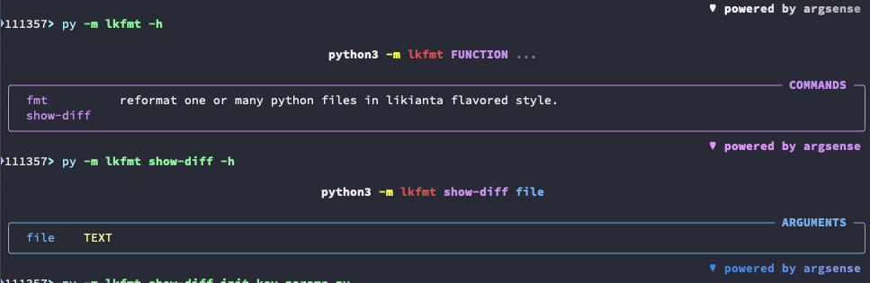
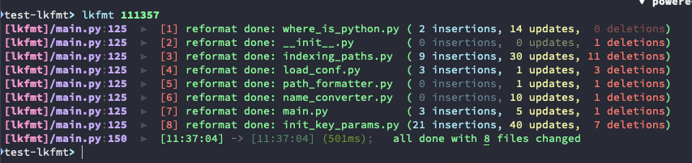
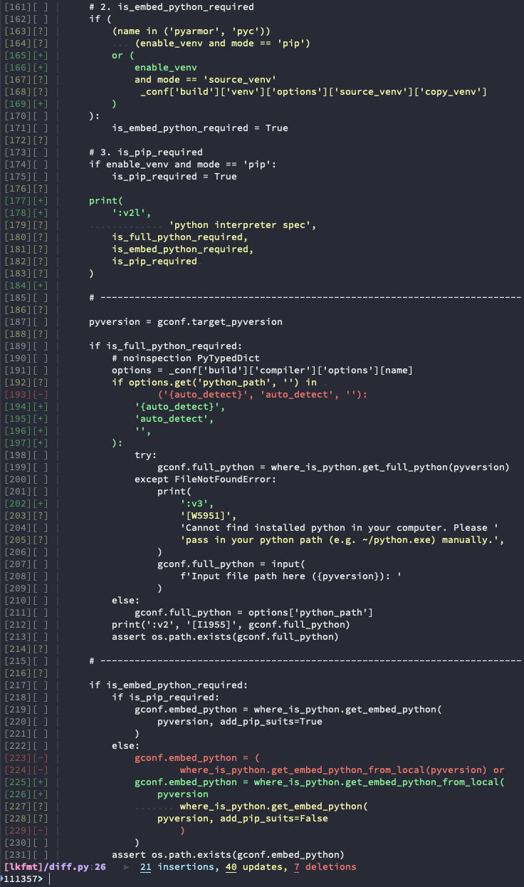

# Likianta Flavored Formatter

`lkfmt` (Likianta flavored formatter) is an integration of `black` + `isort` +
`autoflake` with pre-defined settings to reformat my Python script code.

## Features

- `black` + `isort` + `autoflake` integration
- out-of-box settings
- one command to drive
- additional format styles by lk-flavor (*work in progress*)
    - keep indents on empty lines
    - ensure newline at end of file
    - merge one-line `if`/`for` statements
    - align `:` in dict key-value pairs
    - align `=` in multi-line assignments
    - **tweak `black` styles to balance the visual weight**
    - use `# nofmt` to skip formatting (like `# noqa`)

## Installation

<strike><code>pip install lkfmt</code></strike> (not yet published)

```sh
pip install git+https://github.com/likianta/lkfmt.git
```

## Usage

use in command line:

```sh
# after installation, there's an executable named `lkfmt`.

# get help
lkfmt -h

# format files in current dir
lkfmt .
# it can also be shorthand as `lkfmt` (no argument)

# format files in current dir and subdirs recursively
lkfmt -r .

# format one file
lkfmt $file

# show difference (but not inplace file)
python -m lkfmt show-diff $file
```

## Screenshots






